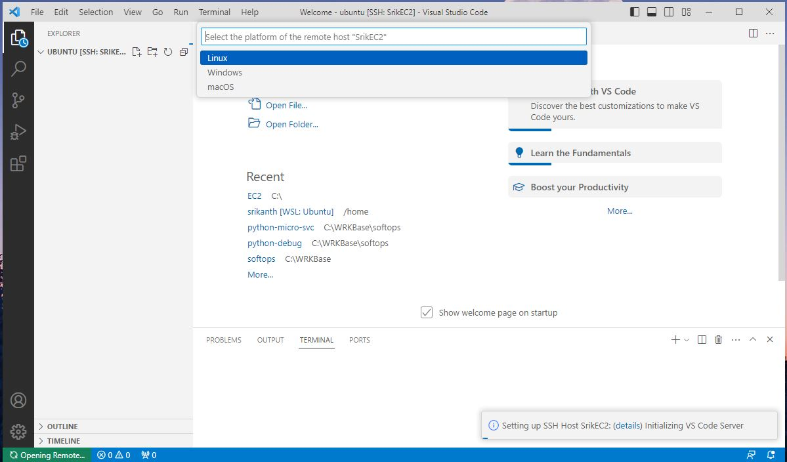
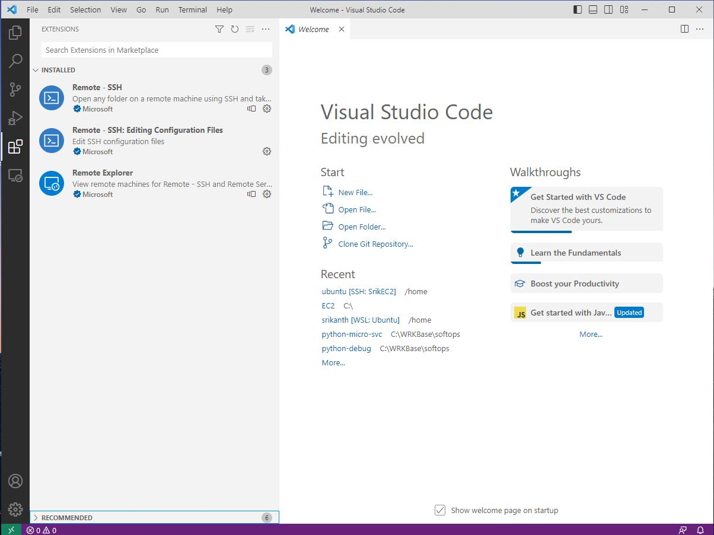
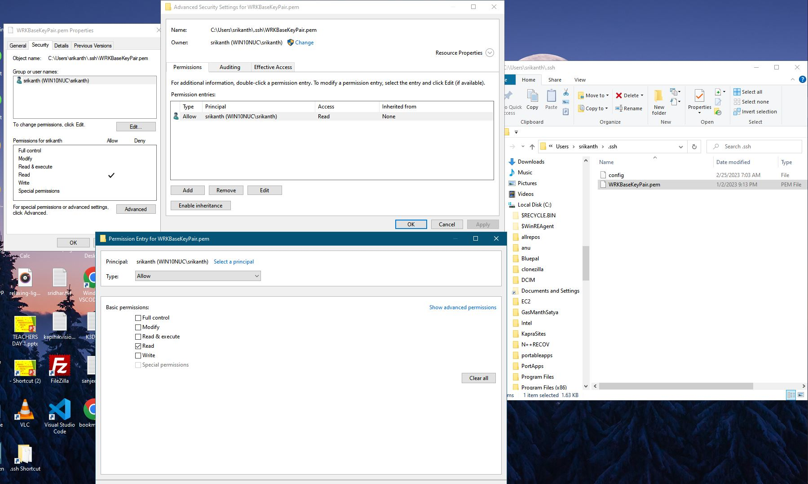
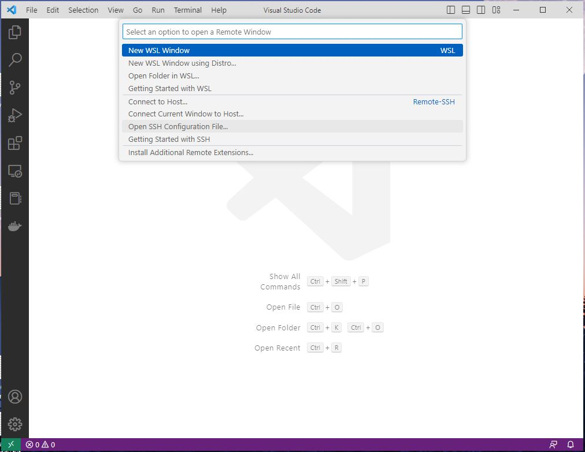
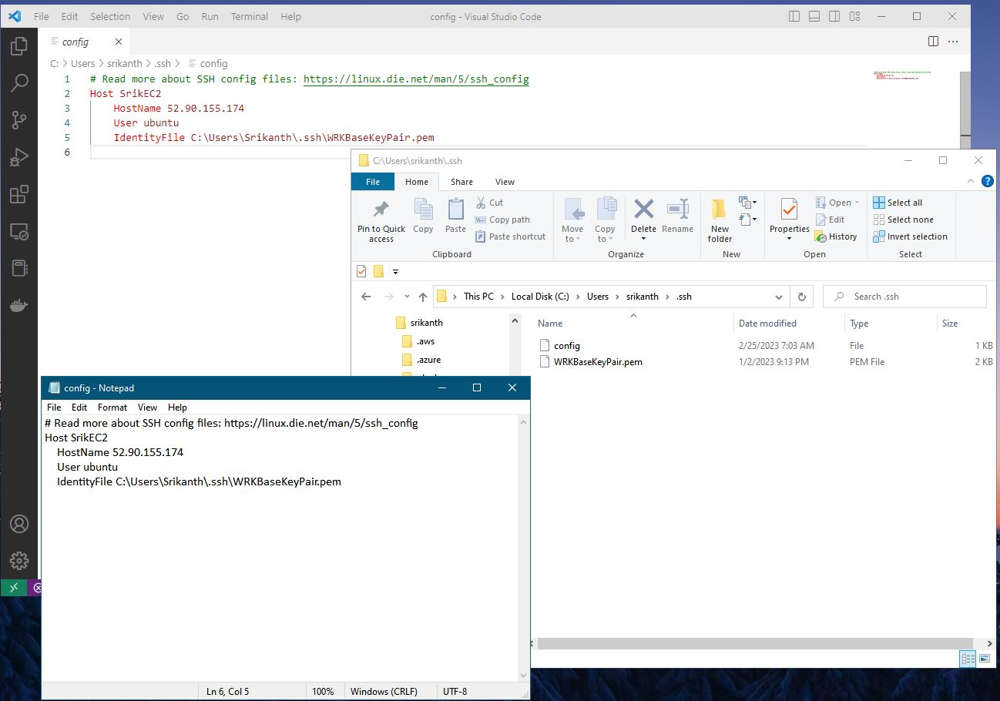
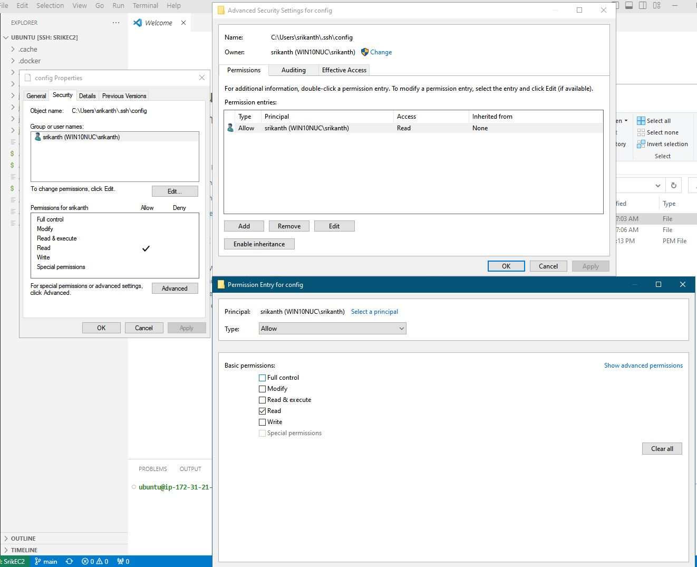
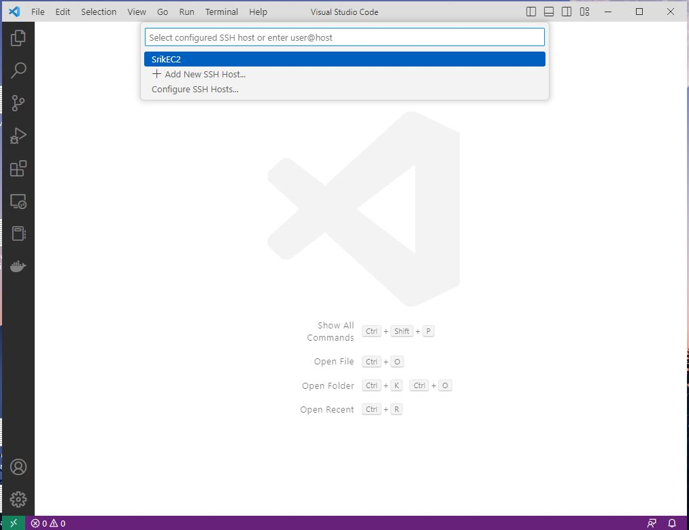
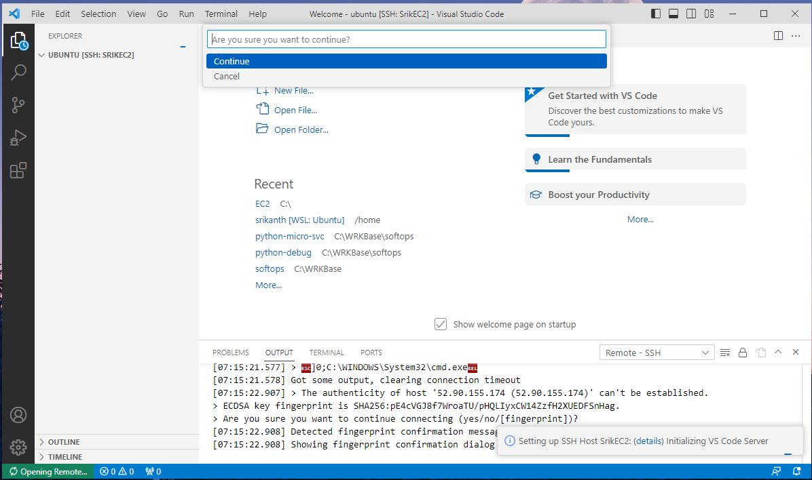
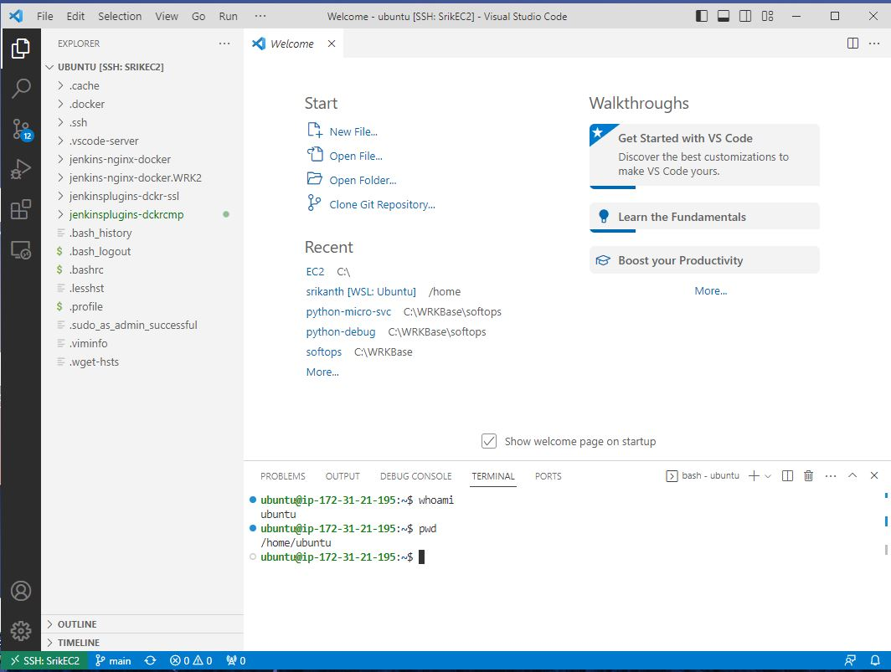

# How to setup VSCode to view linux folders and execute bash commands through SSH
---

****1. Download and Install the MS Windows VSCode application****

****2. Install the VSCode SSH extensions as shown in the below Image-1.
i.e Remote - SSH, Remote - SSH: Editing Configuration Files and Remote Explorer****

****3. Launch an Ubuntu 22.04 Linux AWS EC2 instance with new security group and "Create new key pair"****

****4. Download the new SSH key pair e.g: WRKBaseKeyPair.pem file to your Windows C:\Users\srikanth\.ssh directory****

****5. Change the Widnows Security Permissions on the WRKBaseKeyPair.pem as shown in below Image-2.
and make sure to only allow the current Window User and only Read permissions on the file.****

****6. Click on the bottom green connection symbol "Open a Remote Window" and at the top select "Open SSH Configuration File...", 
then select the location e.g: C:\Users\srikanth\.ssh\config 
then enter the HostName(the ip-address of the EC2 instance), User, IdentityFile valuas as shown in the below Image-3 and Image-4.****

****7. Change the Widnows Security Permissions on the e.g: C:\Users\srikanth\.ssh\config file as shown in below Image-5.
and make sure to only allow the current Window User and only Read permissions on the file.****

****8. Click on the bottom green connection symbol "Open a Remote Window" and at the top select "Connect to Host" and select
newly created Host create in the above config file e.g:SrikEC2
then select "Linux" in the next pop-up and "Continue" in the other pop-up as shown below in the Images 6, 7, 8 and 9.****

****9. To open the remote EC2 Ubuntu home directories, select Explorer and select "Open Folder" then wait for VSCode
to autodetect and populate your home directory /home/ubuntu, then select "OK"****

****10. Open the Terminal --> New Terminal in VSCode Menu to start workng on the bash shell in bottom screen of VSCode.
as shown in Image-10.****

### Watch VSCODE SSH Demo on Youtube:

**Reference Images below:**
---

#### 1. MS VSCode SSH Extenions

#### 2. Windows Security Permissions for SSH files in C:\Users\srikanth\.ssh for VScode to consume

#### 3. VSCode config file setup

#### 4. VSCode config file contents

#### 5. VSCode config file Windows Security Permissions

#### 6. VSCode SSH Connection to EC2 Instance

#### 7. VSCode SSH Connection to EC2 Instance

#### 8. VSCode SSH Connection to EC2 Instance

#### 9. VSCode Connection to EC2 instance confirmation

#### 10. VSCode final Connected screen to AWS EC2 Instance

---
